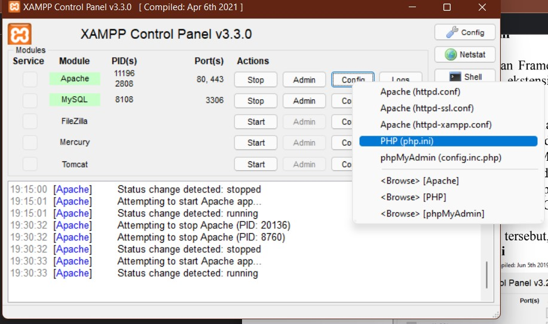
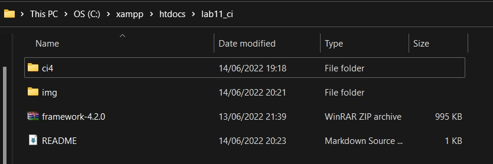
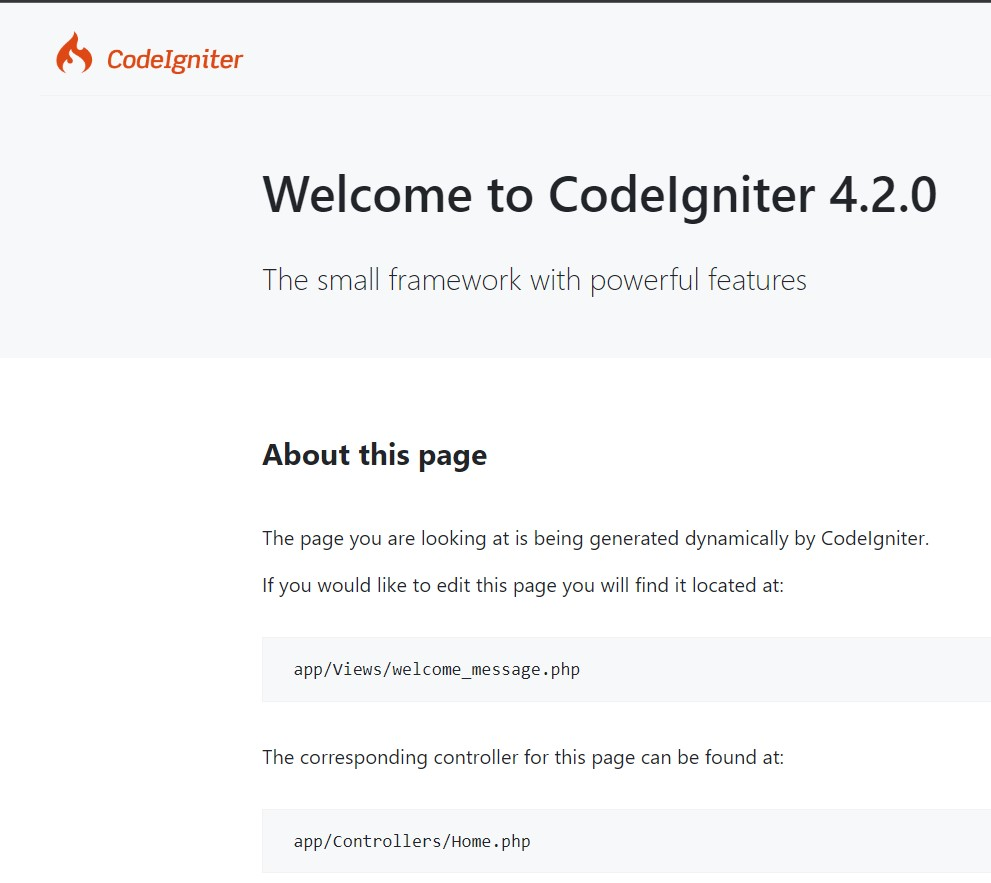
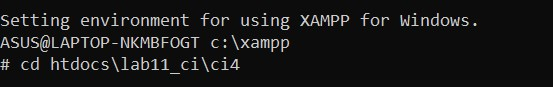
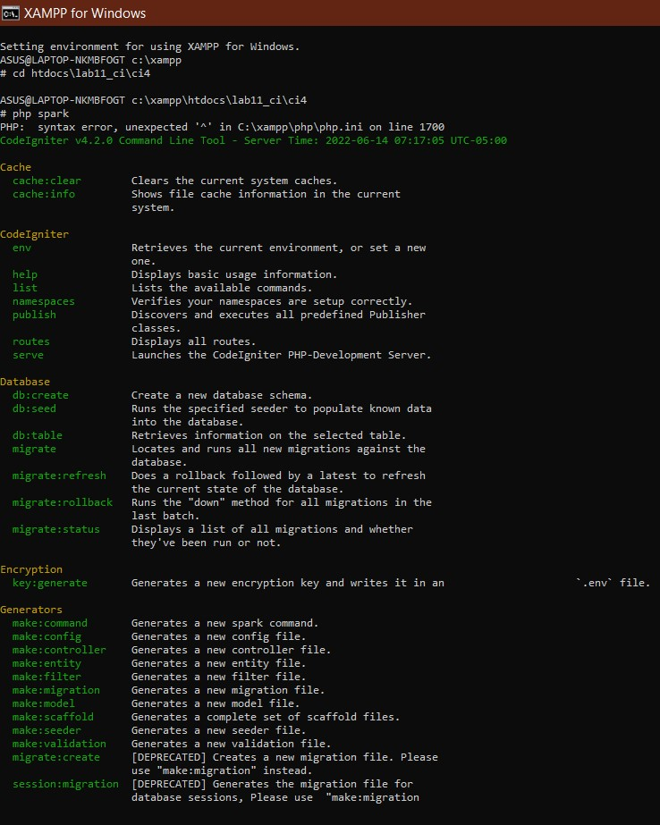
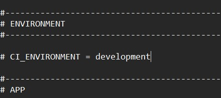
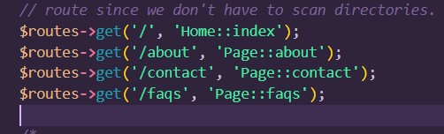
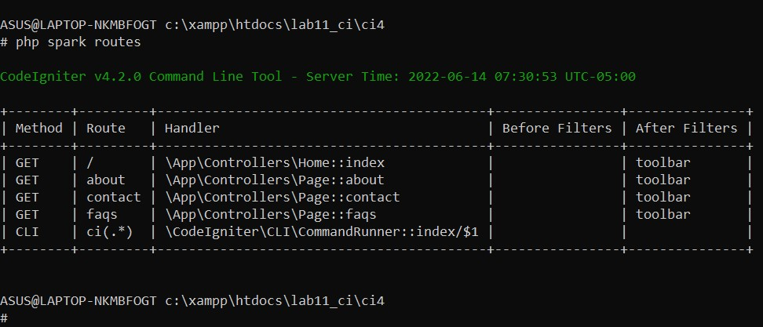
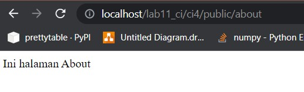

# Pemograman Web
~~~
Nama    : Dani Darmawan
NIM     : 312010154
KELAS   : TI.20.B1
~~~
# AKTIVASI EKSTENSION
Untuk mengaktifkan ekstentsi tersebut, melalu XAMPP Control Panel, pada bagian<br>
Apache klik Config -> PHP.ini



Pada bagian extention, hilangkan tanda ; (titik koma) pada ekstensi yang akan<br>
diaktifkan. Kemudian simpan kembali filenya dan restart Apache web server.

# Instalasi Codeigniter 4
Untuk melakukan instalasi Codeigniter 4 dapat dilakukan dengan dua cara, yaitu cara<br>
manual dan menggunakan composer. Pada praktikum ini kita menggunakan cara manual.<br>
• Unduh Codeigniter dari website https://codeigniter.com/download<br>
• Extrak file zip Codeigniter ke direktori htdocs/lab11_ci.<br>
• Ubah nama direktory framework-4.x.xx menjadi ci4.<br>

• Buka browser dengan alamat http://localhost/lab11_ci/ci4/public/<br>


# Menjalankan CLI (Command Line Interface)
Codeigniter 4 menyediakan CLI untuk mempermudah proses development. Untuk <br>
mengakses CLI buka terminal/command prompt.<br>

Arahkan lokasi direktori sesuai dengan direktori kerja project dibuat<br>
(xampp/htdocs/lab11_ci/ci4/)<br>
lalu masukan perintah php spark<br>


# Mengaktifkan Mode Debugging
Ubah nama file env menjadi .env kemudian buka file tersebut dan ubah nilai variable<br>
CI_ENVIRINMENT menjadi development.


# Membuat Route Baru
Tambahkan kode berikut di dalam Routes.php<br>
```
$routes->get('/about', 'Page::about');
$routes->get('/contact', 'Page::contact');
$routes->get('/faqs', 'Page::faqs');
```
<br>
Untuk mengetahui route yang ditambahkan sudah benar, buka CLI dan jalankan<br>
perintah ```php spark routes```<br>
<br>

# Membuat Controller
Buat file baru dengan nama page.php<br>
pada direktori Controller kemudian isi kodenya seperti berikut.<br>
```
<?php
namespace App\Controllers;
class Page extends BaseController
{
public function about()
{
echo "Ini halaman About";
}
public function contact()
{
echo "Ini halaman Contact";
}
public function faqs()
{
echo "Ini halaman FAQ";
}
}
```
refresh kembali dan hasil akan berubah<br>
<br>
